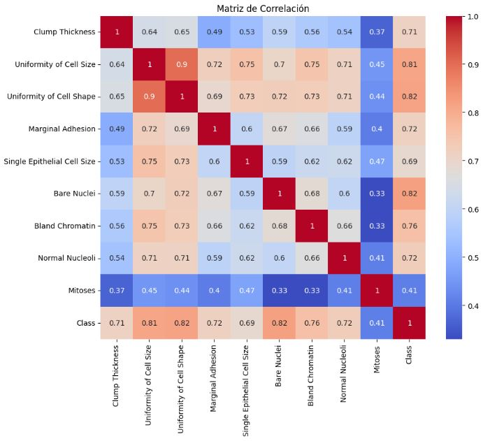

from pathlib import Path
# Clasificador de Cáncer de Mama

Aplicación interactiva para la predicción del cáncer de mama usando Machine Learning. Este proyecto utiliza un modelo de Random Forest entrenado con el dataset Breast Cancer Wisconsin Diagnostic Data Set (UCI).

---

## 🔍 Descripción
Esta aplicación permite predecir si un tumor es **maligno** o **benigno** a partir de medidas obtenidas de una imagen digitalizada de una biopsia de mama. El modelo fue entrenado con variables numéricas como la textura, radio, concavidad y otras características morfológicas.

---

## 🧠 Tecnologías usadas
- Python (Pandas, Scikit-learn, Seaborn, Joblib)
- Streamlit para el despliegue de la app web
- VSCode como entorno de desarrollo
- Git + GitHub para control de versiones

---

## 📁 Estructura del Proyecto
```
Proyecto_clasificacion_cancerdemama/
├── app.py
├── data/
│   └── data.txt
├── model/
│   ├── model_rf.pkl
│   └── feature_pipeline_rf.pkl
├── pictures/
│   └── matriz_correlacion.JPG
├── .gitignore
├── README.md
└── requirements.txt
```

---

## 🧪 Resultados del Modelo

| Modelo        | Accuracy | Precision | Recall | F1-score |
|---------------|----------|-----------|--------|----------|
| Random Forest | 0.97     | 0.96      | 0.98   | 0.97     |

*Los resultados fueron obtenidos con validación cruzada y test set.*

---

## 📊 Variables del Dataset

| Variable            | Descripción                                        |
|---------------------|---------------------------------------------------|
| radius_mean         | Promedio del radio de las células                 |
| texture_mean        | Promedio de la textura                            |
| perimeter_mean      | Promedio del perímetro                           |
| area_mean           | Promedio del área                               |
| smoothness_mean     | Suavidad media de los bordes                      |
| ...                 | ...                                               |

> Se eliminaron columnas irrelevantes como `ID` para evitar sesgos.

---

## 🚀 Ejecución Local
1. Clona el repositorio:
   ```bash
   git clone https://github.com/xionafrica/Deploy_cancer_de_mama.git
   ```
2. Instala las dependencias:
   ```bash
   pip install -r requirements.txt
   ```
3. Ejecuta la app:
   ```bash
   streamlit run app.py
   ```

---

## 📸 Visualizaciones

Matriz de correlación:


---

## 🙋 Acerca de Mí
Mi nombre es **Xion Africa** y estoy en proceso de consolidarme como Data Scientist freelance, ayudando a empresas a automatizar procesos mediante inteligencia artificial.

- 🌐 [LinkedIn](https://www.linkedin.com/in/xionafrica/)
- 💻 [GitHub](https://github.com/xionafrica)

---

## 🤝 Conéctate Conmigo
No dudes en contactarme si te interesa colaborar, tienes preguntas o deseas mejorar algún aspecto del proyecto. Estoy abierto a feedbacks y colaboraciones.

---

## ⚠ Notas Finales
- Este proyecto es educativo y no debe utilizarse en contextos clínicos reales sin validación profesional.
- Los datos fueron transformados con un pipeline (`feature_pipeline_rf.pkl`) antes de la predicción, asegurando coherencia con el entrenamiento.

